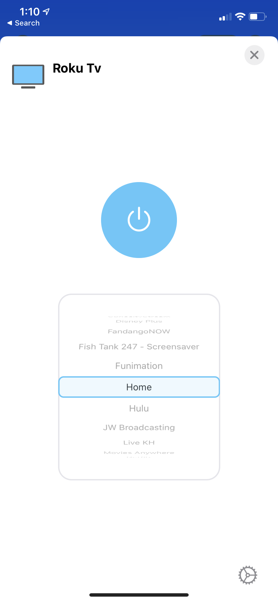
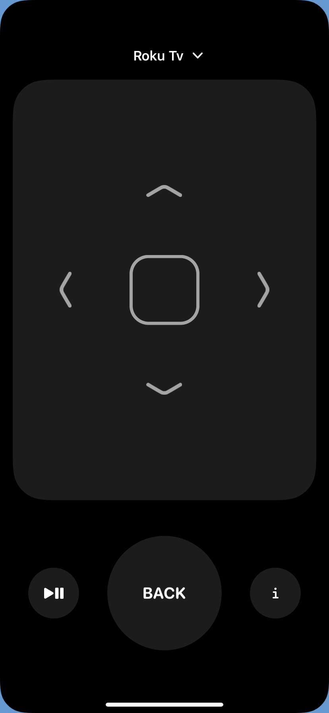

# Roku Tv Homebridge Plugin

This is a plugin designed to give you Roku Tv fully integrated with the Home app.
Plugins that I could find for myself seemed to only have switches for all the actions when there is a Television Service that you can use. So with that goal in mind I set out to create this. Im fairly happy with the results.

# Things to note for those not familer with the Home app
The home app will only control the power state and the active app.
To control with the remote you have to have the remote turned on in the control center and navigate to that.
